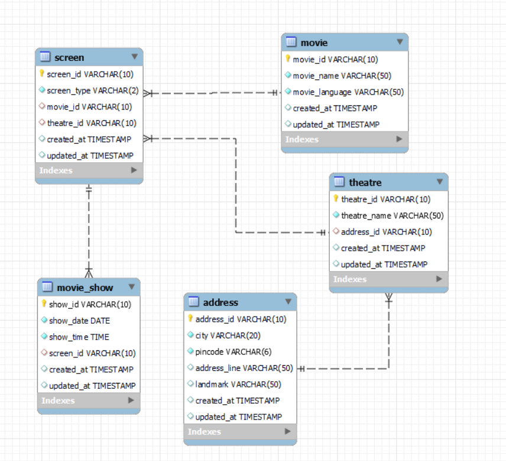

# book-my-show
Designing a database model for book my show


# Book My Show DB Modelling

This project contains the SQL scripts for designing and populating a sample database for a movie ticket booking system similar to Book My Show.

## Database Structure

The database consists of the following tables:

- **address**: Stores address details for theatres.
- **theatre**: Contains information about theatres.
- **movie**: Stores movie details.
- **screen**: Represents screens in theatres, linked to movies and theatres.
- **movie_show**: Contains show timings for movies on specific screens.

## How to Use

1. Run the SQL script [`Book_my_show_DB_Modelling.sql`](Book_my_show_DB_Modelling.sql) in your MySQL environment.
2. The script will:
    - Create the `book_my_show` database.
    - Create all required tables with relationships.
    - Insert sample data for addresses, theatres, movies, screens, and shows.
    - Provide a sample query to fetch all shows for a specific date and theatre.

## Sample Query

The script includes a query to fetch all shows for `2025-09-22` at the theatre `PVR-NEXUS`:

```sql
SELECT 
    ms.show_id, ms.show_date, ms.show_time, sc.screen_id, sc.screen_type, 
    t.theatre_name, m.movie_name, m.movie_language
FROM
    movie_show AS ms
    LEFT JOIN screen AS sc ON ms.screen_id = sc.screen_id
    LEFT JOIN theatre AS t ON sc.theatre_id = t.theatre_id
    LEFT JOIN movie as m ON sc.movie_id = m.movie_id
WHERE
    ms.show_date = '2025-09-22'
    AND theatre_name = 'PVR-NEXUS';
```


### Database Design


## Requirements

- MySQL or compatible SQL database.

## Author
- Tejeswari Malipeddi
